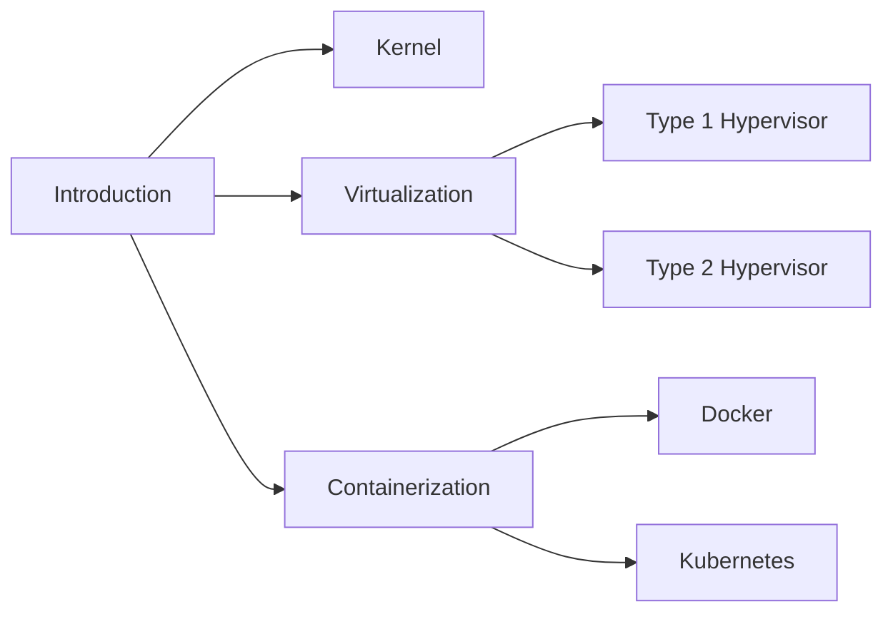

# Structure Plans

```mermaid
  graph LR;
      intro[Introduction]
      kernel[Kernel]
      virtualization[Virtualization]
      containerization[Containerization]
      type1[Type 1 Hypervisor]
      type2[Type 2 Hypervisor]
      docker[Docker]
      kubernetes[Kubernetes]
      
      intro-->kernel;
      intro-->virtualization;
      intro-->containerization;

      virtualization-->type1
      virtualization-->type2

      containerization --> docker
      containerization --> kubernetes
```